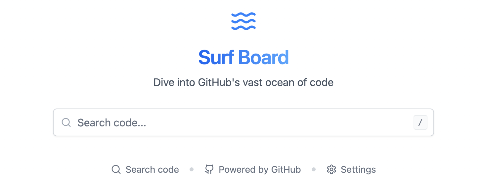

<div align="center">

  

**Modern GitHub Search Tool**

</div>

Surf Board is built with React, TypeScript, and Vite. It provide smooth code search experience with modern UI/UX features.

## Features

- 🔍 GitHubコード検索
  - プログラミング言語ファイルの自動フィルタリング
  - 3文字以上で自動検索開始
  - デバウンス処理による最適化（500ms）
  - 30件ごとの無限スクロール（最大1000件）

- ⌨️ キーボードショートカット
  - `/` キーで検索フォーカス
  - `Enter` で即時検索実行

- 🎨 モダンなUI/UX
  - ダークモード対応
  - スムーズなアニメーション効果
  - スケルトンローディング
  - レスポンシブデザイン

## Tech Stack

- **Framework**
  - React 18.3.1
  - TypeScript 5.5.3
  - Vite 5.4.2

- **Styling**
  - TailwindCSS 3.4.1
  - clsx/tailwind-merge（条件付きクラス）

- **UI/UX**
  - framer-motion（アニメーション）
  - lucide-react（アイコン）
  - Prism.js（シンタックスハイライト）

## Project Structure

```
src/
├── animations/          # アニメーションレイヤー
│   ├── constants/      # アニメーション定数
│   │   └── spring.ts   # スプリングアニメーション設定
│   ├── variants/       # アニメーションバリアント
│   │   ├── container.ts # コンテナアニメーション
│   │   ├── fade.ts     # フェードアニメーション
│   │   └── skeleton.ts # スケルトンアニメーション
│   └── index.ts        # 一元的なエクスポート
├── components/          # Reactコンポーネント
│   ├── CodeResult/     # コードスニペット表示
│   ├── SearchBar/      # 検索入力
│   ├── SearchHero/     # メインビジュアル
│   ├── SearchResults/  # 検索結果一覧
│   └── Settings/       # 設定画面
├── context/            # Reactコンテキスト
│   ├── GitHubTokenContext.tsx   # トークン管理
│   └── SearchSettingsContext.tsx # 検索設定
├── hooks/              # カスタムフック
│   └── useCodeSearch.ts # 検索ロジック
├── layouts/            # レイアウト
├── styles/            # スタイル定義
├── types/             # 型定義
└── utils/             # ユーティリティ
```

### アニメーションレイヤー

アニメーションレイヤーは、アプリケーション全体のアニメーションを一元管理します：

- **constants/** - 再利用可能なアニメーション定数
  - spring.ts: スプリングアニメーションの基本設定

- **variants/** - Framer Motionのアニメーションバリアント
  - container.ts: レイアウトアニメーション
  - fade.ts: フェードイン/アウトアニメーション
  - skeleton.ts: スケルトンローディングアニメーション

使用例：
```tsx
import { fadeIn, springTransition } from '@/animations';

// コンポーネントでの使用
<motion.div {...fadeIn}>
  <YourContent />
</motion.div>
```

## Setup

1. 依存パッケージのインストール:
```bash
npm install
# または
bun install
```

2. GitHubトークンの設定:
- GitHubの[Personal Access Tokens](https://github.com/settings/tokens)ページで新しいトークンを生成
- 以下のいずれかの方法でトークンを設定:
  a. 環境変数による設定（開発時）:
     - `.env.local`ファイルをプロジェクトルートに作成
     - `VITE_GITHUB_TOKEN=your_token_here`を追加
  b. アプリケーションの設定画面でトークンを入力（実行時）

3. 開発サーバーの起動:
```bash
npm run dev
# または
bun dev
```

## 検索機能

### 基本的な使い方
1. GitHubトークンを設定
2. 検索キーワードを入力（3文字以上）
3. 自動的に検索が開始
4. 必要に応じて非プログラミングファイルの除外設定を調整

### 検索結果
- ファイル名とパスの表示
- リポジトリ情報の表示
- コードスニペットのシンタックスハイライト
- 無限スクロールによる追加読み込み

## 設定オプション

- **GitHubトークン**: 検索機能を利用するために必要
- **非プログラミングファイルの除外**: 検索結果から設定ファイルやドキュメントを除外

## 開発者向け情報

### ビルド
```bash
npm run build
# または
bun build
```

### リント
```bash
npm run lint
# または
bun lint
```

## ライセンス

MIT License
